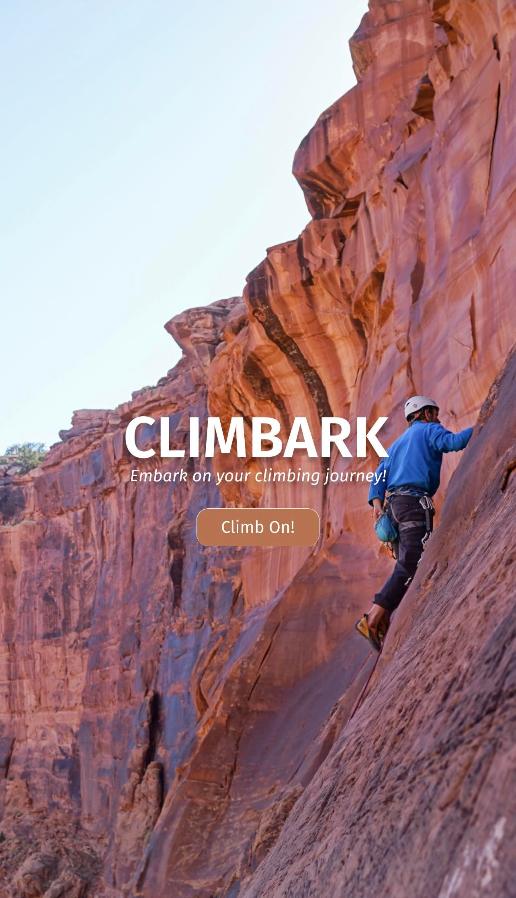
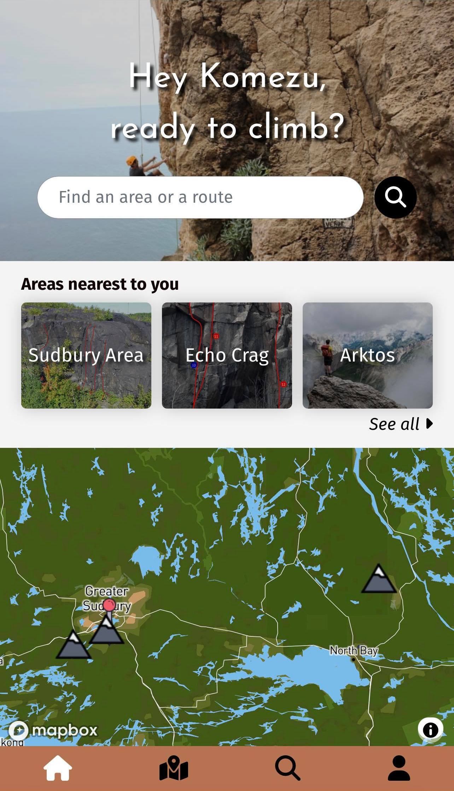
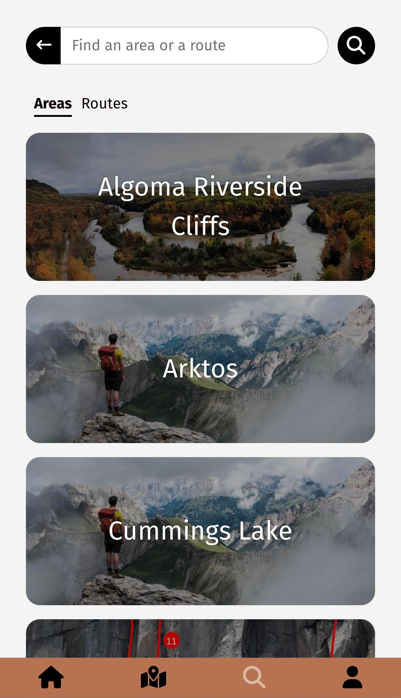
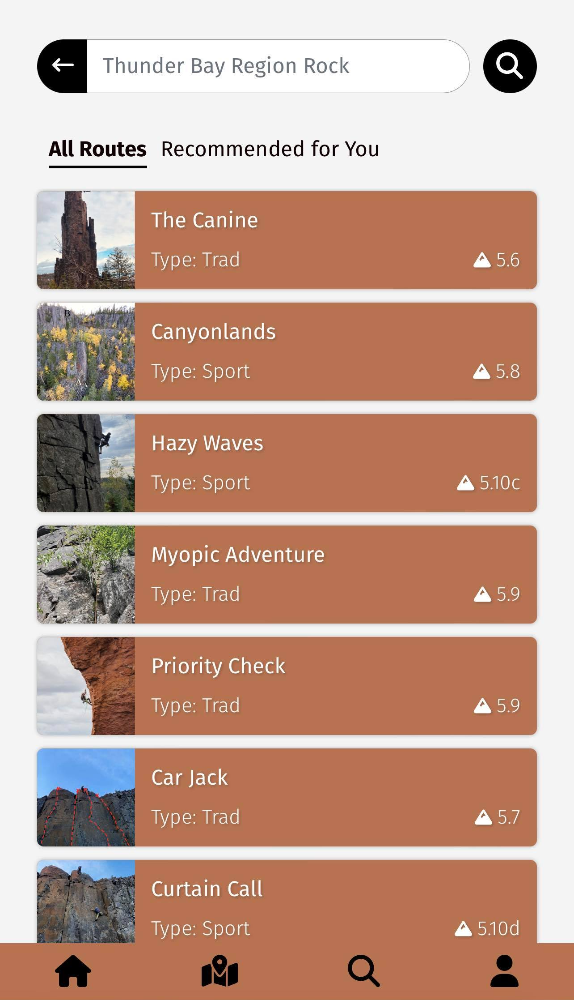
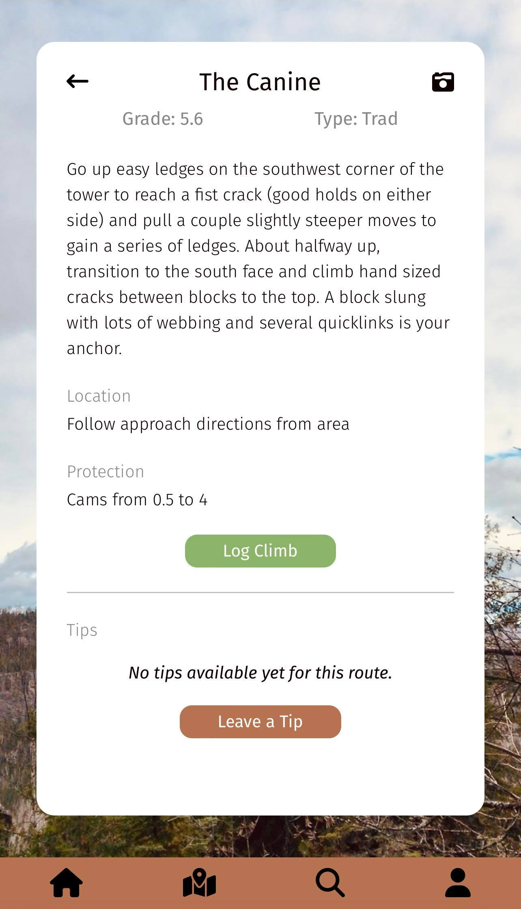
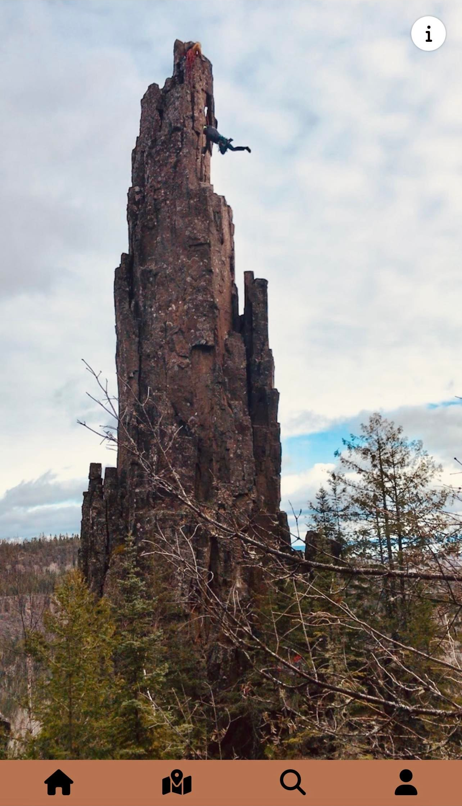
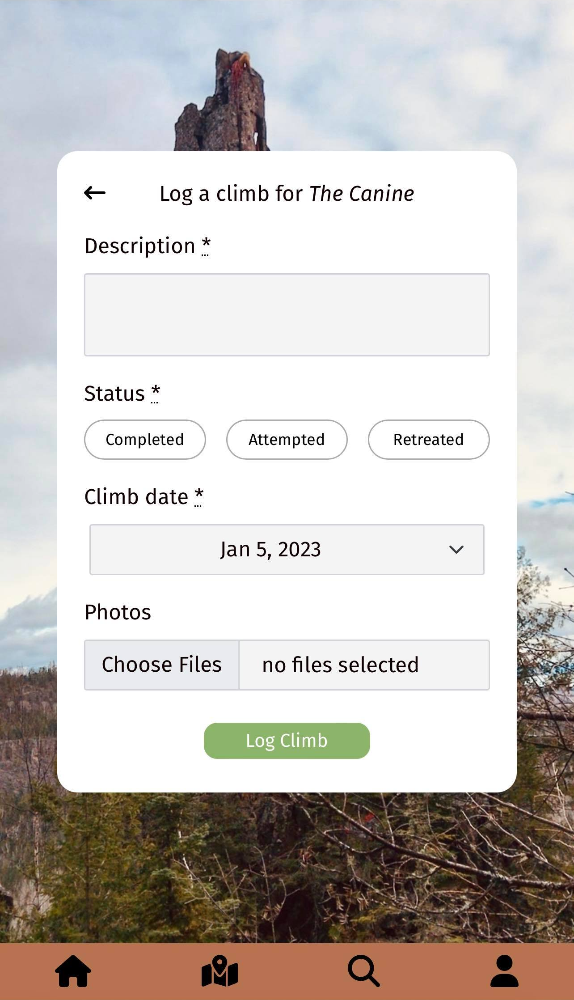
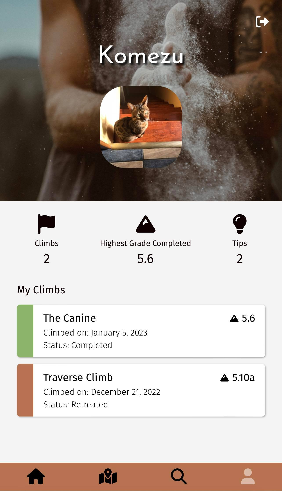
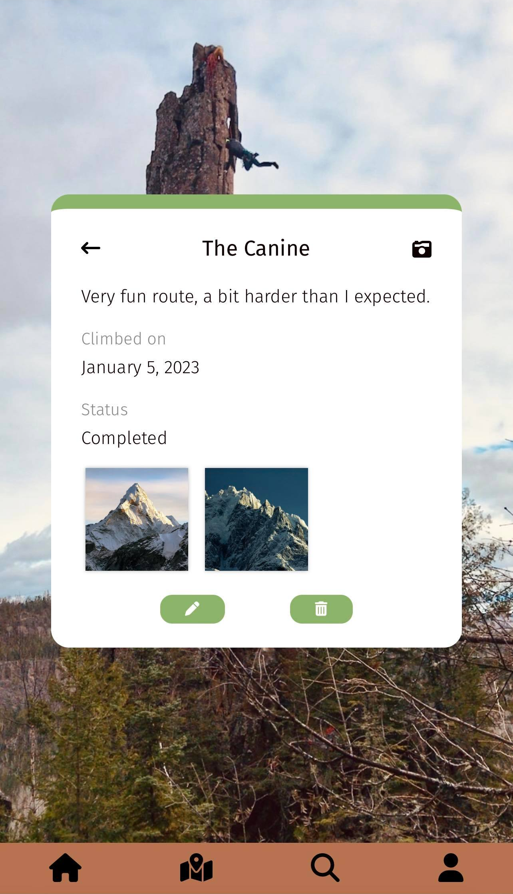
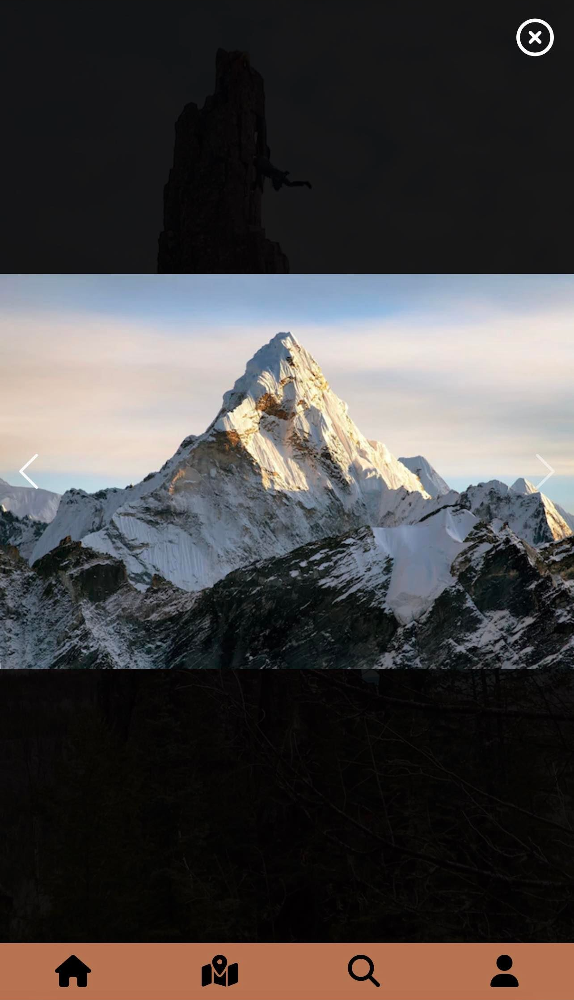

# Climbark

A [mobile web app](http://www.climbark.com) designed for rock climbers to browse and search for routes, log their climbs, and share tips on routes with ease.

Created as a 2-week final project during the Le Wagon Montréal Bootcamp in Nov-Dec 2022.

*Note: The nearest areas feature is a work in progress. Areas displayed on the home page are defaults. Climbark does not currently access your location.*

## Features

- Climb log that can be updated easily
- Information on routes, including photo if available
- Routes lookup by name, type or grade
- Route suggestions based on user's highest grade climbed
- Tip sharing with other users
- Map displaying area locations

## Demo

[Video available.](https://youtu.be/3jZFHTANuRQ?t=2875)

## Screenshots

## Authors

- [@redvelvet511](https://github.com/redvelvet511)
- [@Komezu](https://github.com/Komezu)
- [@nifemioyekunle](https://github.com/nifemioyekunle)

## Acknowledgements

Current data sample for areas and routes comes from the [Mountain Project](https://www.mountainproject.com/area/118724037/ontario-north-bouldering-and-rock) website (Ontario North only).

This project uses configurations generated with [lewagon/rails-templates](https://github.com/lewagon/rails-templates), created by the [Le Wagon coding bootcamp](https://www.lewagon.com) team.
